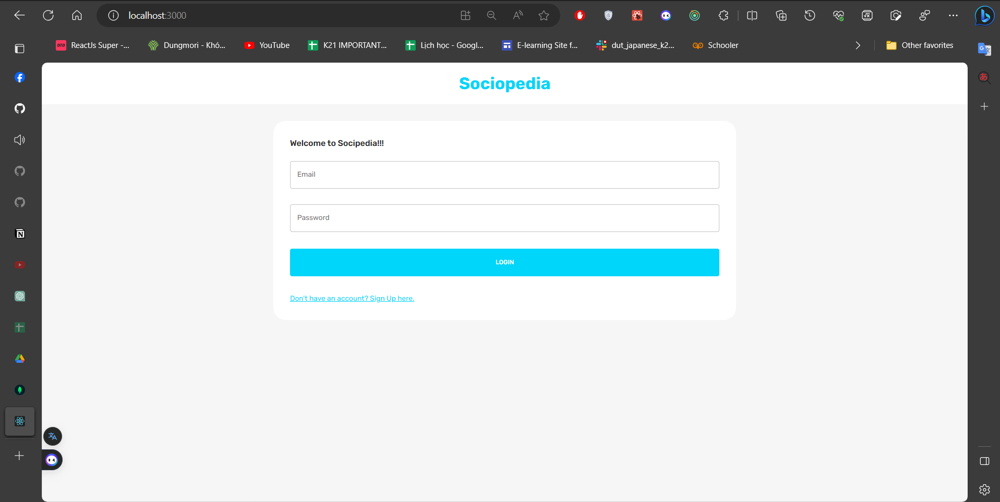
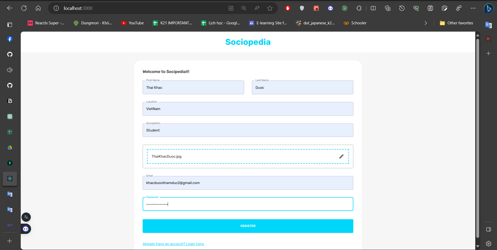
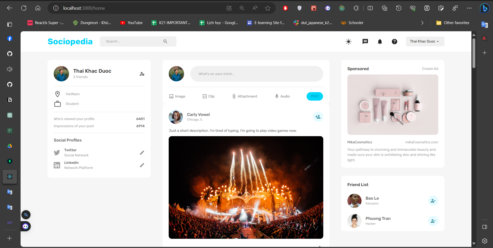
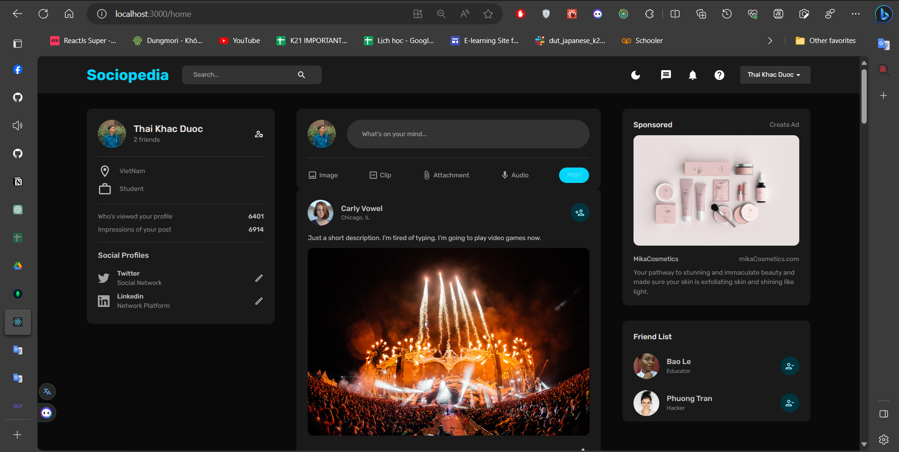
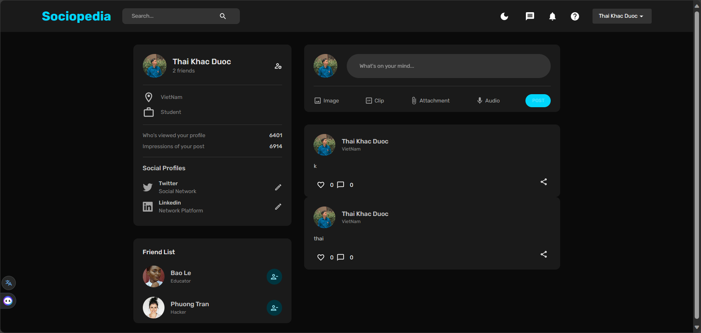
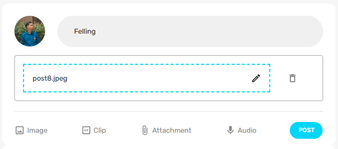
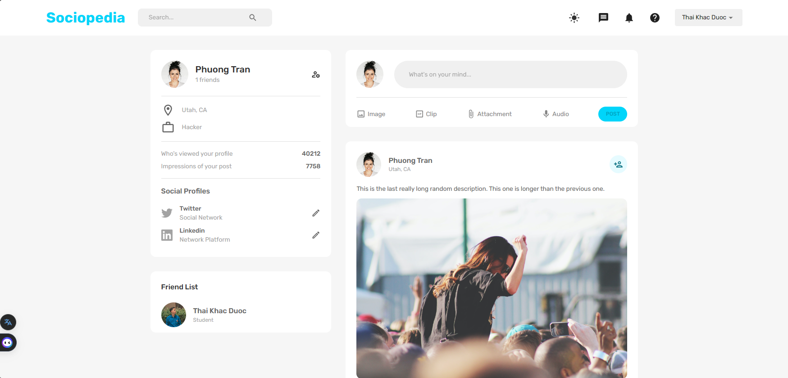
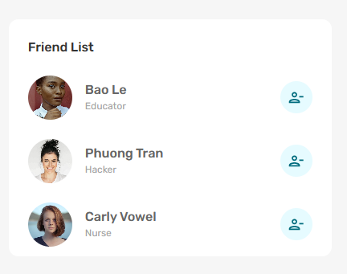

# Social Media App

## Introduction

**Project Name**: Social Media App

**Main Function**: Connecting people through a social media platform.

### Technology:
- **Backend**: NodeJS
- **Frontend**: ReactJS with UI design using the MUI library.
- **Database**: MongoDB

## Project Context

### Motivation:
I wanted to design a website that emulates platforms like Twitter and Facebook, utilizing the knowledge I have gained from studying new technologies.

**Timeframe**: Primarily developed over 2 months (20/06/2023 - 15/08/2023)

**Role**: Individual project

## Product Functions

### Common functions:
- **Login**: 
- **Sign up**: 
- **Logout**

### Functions for users:

- **Home page**: 
- **DarkMode**: Set dark interface display for the entire website. 
- **Display personal page information**: Display personal information, friends list, residence, country, occupation, number of followers, all posts by that user, etc. 
- **Post**: Share current status with photos. 
- **Make friends**: Interact with users who post and become friends. 
- **Interact with an article**: Bookmark or read comments. 
- **View other people's information**: Access other's profiles and view their information. 
- **Interact with friends**: Add and remove friend feature. 

## Technical Highlights

- **Security**: Implemented JSON Web Token (JWT) and refresh tokens for authentication and authorization, ensuring secure access to the system. Used Spring Security to create security layers on the server-side.
- **Regarding Security**: Bcrypt is used to encrypt user passwords. Login uses JWT of jsonwebtoken. All user information and transmitted data are encrypted for safety using JWT.
- **High performance**: The application is optimized for fast page loading speeds and a smooth experience.
- **User-friendly interface**: The UI is intuitive and easy to navigate, ensuring a user-friendly experience.

## Installation and Running

1. **Install dependencies**:
```
yarn
```

2. **Run the server (backend)**:

Navigate to the server directory:
```
cd server
```
Then, run the server using `nodemon`:
```
nodemon index.js
```

3. **Run the client (frontend)**:

In a new terminal/tab, navigate to the client directory:
```
cd client
```
Start the frontend application:
```
yarn start
```

## Configuration

Ensure you have a `.env` file in the root directory of the server with the necessary environment variables, for

 example:

```
MONGO_URL = mongodb+srv://<nameDatabse>:<password>@cluster0.szwgcwl.mongodb.net/?retryWrites=true&w=majority
JWT_SECRET = 'somesuperhardstringtoguess'
PORT = 3001
```

**Video demo of the functionalities**: [Link to YouTube](https://youtu.be/4D0hHKPI8Jc)
